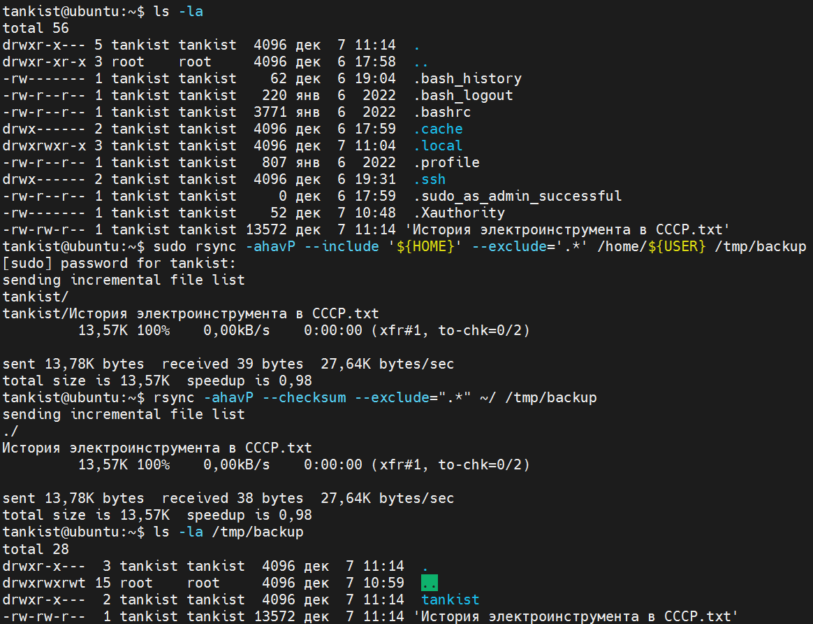
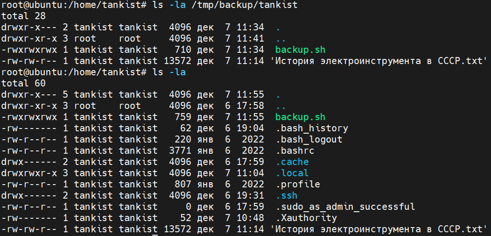
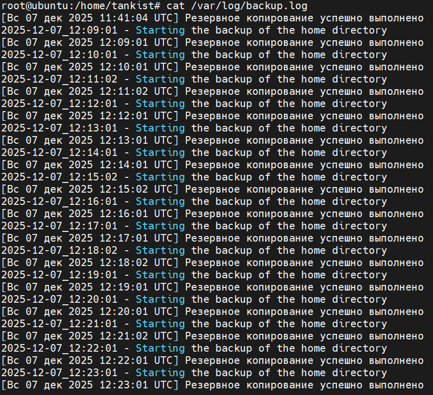
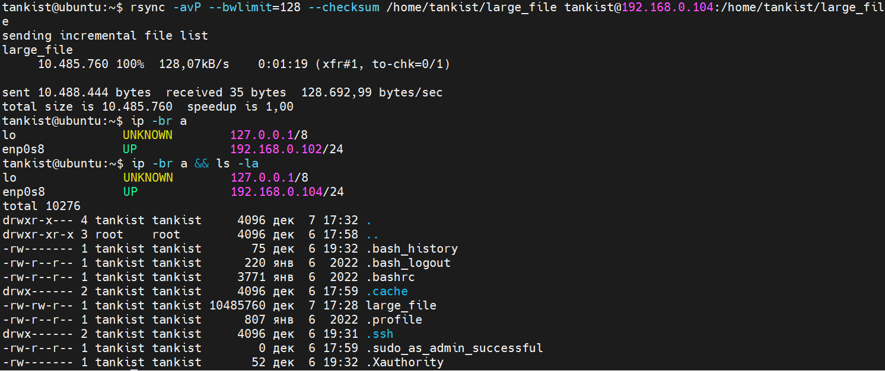
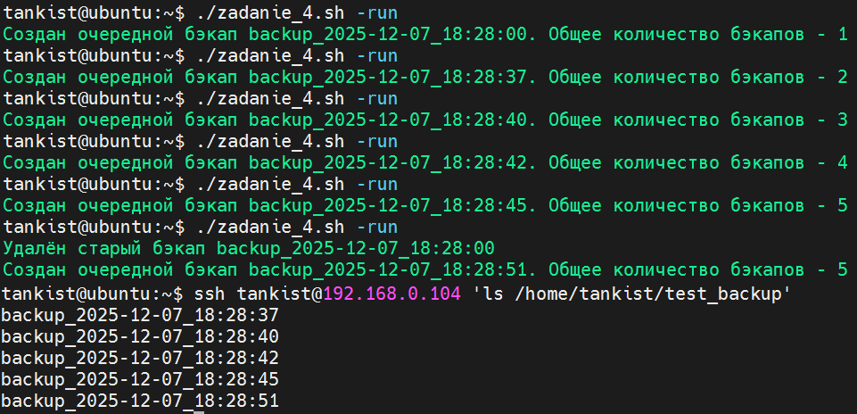
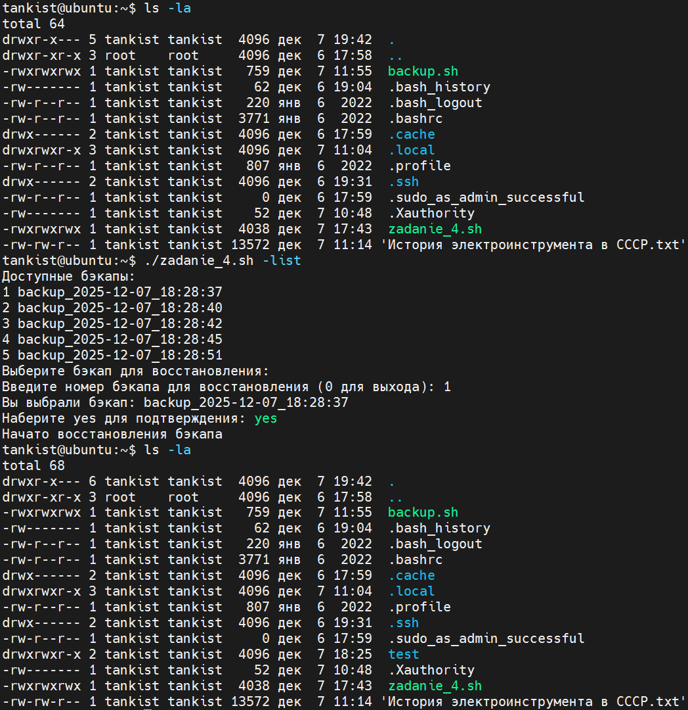

# Домашнее задание к занятию «Резервное копирование»

## Задание 1
**Решение** </br>
Скриншот с командой для резервного копирования:

</br>
## Задание 2
**Решение** </br>
Скрипт на резервное копирование домашней директории пользователя с помощью rsync:
```
#!/bin/bash

sudo su
echo "$(date +%Y-%m-%d_%H:%M:%S) - Starting the backup of the home directory" >> /var/log/backup.log

# Команда rsync. Cтандартный вывод - в /dev/null, ошибки - в лог.
rsync -ahavP --include '${HOME}' --exclude='.*' /home/tankist /tmp/backup
rsync -ahavP --checksum --exclude=".*" /home/tankist/ /tmp/backup/ > /dev/null 2>> /var/log/backup.log

# Проверка кода завершения rsync и запись лога
if [ $? -eq 0 ]; then
    echo "[$(date)] Резервное копирование успешно выполнено" >> /var/log/backup.log
else
    echo "[$(date)] Ошибка при выполнении резервного копирования" >> /var/log/backup.log
fi
```
Описание задачи в cron:
```
root@ubuntu:/home/tankist# crontab -e
```
Изменённый под задачу ежедневного резервного копирования в 13:00 cron файл:
```
# Edit this file to introduce tasks to be run by cron.
#
# Each task to run has to be defined through a single line
# indicating with different fields when the task will be run
# and what command to run for the task
#
# To define the time you can provide concrete values for
# minute (m), hour (h), day of month (dom), month (mon),
# and day of week (dow) or use '*' in these fields (for 'any').
#
# Notice that tasks will be started based on the cron's system
# daemon's notion of time and timezones.
#
# Output of the crontab jobs (including errors) is sent through
# email to the user the crontab file belongs to (unless redirected).
#
# For example, you can run a backup of all your user accounts
# at 5 a.m every week with:
# 0 5 * * 1 tar -zcf /var/backups/home.tgz /home/
#
# For more information see the manual pages of crontab(5) and cron(8)
#
# m h  dom mon dow   command

13 00 * * * /home/tankist/backup.sh
```
Для теста скрипта была использована иная настройка cron (чтобы не ждать сутки):
```
* * * * * /home/tankist/backup.sh
```
Результат запуска скрипта представлен на рисунке 2.1:

</br>
Лог резервного копирования с помощью cron представлен на рисунке 2.2:

</br>
## Задание 3
**Решение** </br>
Создание "тяжёлого" файла:
```
tankist@ubuntu:~$ dd if=/dev/random of=/home/tankist/large_file bs=1M count=10
10+0 records in
10+0 records out
10485760 bytes (10 MB, 10 MiB) copied, 0,0560118 s, 187 MB/s
```
Результат выполнения команды с ограничением параметров представлен на рисунке 3:

</br>
Вторая виртуальная машина создавалась методом клонирования первой для ускорения выполнения задания, поэтому имя компьютера и имя пользователя одинаковые.
## Задание 4
**Решение** </br>
Скрипт, который будет производить инкрементное резервное копирование домашней директории пользователя с помощью rsync на другой сервер:
```
#!/bin/bash

# Параметры скрипта
SOURCE_DIR="/home/tankist/test"
REMOTE_HOST="tankist@192.168.0.104"
REMOTE_DIR="/home/tankist/test_backup"
BACKUP_PREFIX="backup"
MAX_BACKUPS=5

# Проверяем создана ли директория в которую будут записаны бэкапы
ssh "$REMOTE_HOST" "test -d $REMOTE_DIR/ || mkdir -p $REMOTE_DIR "

# Функция для создания инкрементного бэкапа.
# В rsync указываем в качестве референсной директории - предыдущий бэкап на удаленном сервере.
# Создаём очередной бэкап c датой и временем в имени, в дальнейшем получить имя самого нового или
# самого старого бэкапа можно просто выполнив ls [-r] | grep backup | tail -1
# Проверяем были ли созданы бэкапы до этого. Если папка пустая, то создаём первый (без опции -link-dest)
create_backup() {
  new_backup_name="${BACKUP_PREFIX}_$(date +%Y-%m-%d_%H:%M:%S)"
  if ssh "$REMOTE_HOST" "ls -d $REMOTE_DIR/${BACKUP_PREFIX}*" >/dev/null 2>&1 ; then
      latest_backup=$(ssh "$REMOTE_HOST" "ls $REMOTE_DIR/ | grep $BACKUP_PREFIX | tail -1")
      rsync -a --link-dest="$REMOTE_DIR/$latest_backup" --delete  "$SOURCE_DIR/" "$REMOTE_HOST:$REMOTE_DIR/$new_backup_name"
  else
      rsync -a --delete  "$SOURCE_DIR/" "$REMOTE_HOST:$REMOTE_DIR/$new_backup_name"
  fi
}

# Функция для удаления самого старого бэкапа при количестве бэкапов более MAX_BACKUPS
delete_oldest_backup() {
  oldest_backup=$(ssh "$REMOTE_HOST" "ls -r $REMOTE_DIR/ | grep $BACKUP_PREFIX | tail -1")
  ssh "$REMOTE_HOST" "rm -rf $REMOTE_DIR/$oldest_backup"
}
if [[ "$1" == "-run" ]]; then
    # Подсчитываем количество бэкапов, если их больше MAX_BACKUPS, то удаляем самый старый бэкап и пишем следующий
    num_backups=$(ssh "$REMOTE_HOST" "find $REMOTE_DIR -mindepth 1 -maxdepth 1 -name '$BACKUP_PREFIX*' -type d | grep -v '^$' | wc -l")
    if [ "$num_backups" -ge "$MAX_BACKUPS" ]; then
        delete_oldest_backup
        num_backups=$(( num_backups - 1 ))
        echo "Удалён старый бэкап $oldest_backup"
    fi
    create_backup
    num_backups=$(( num_backups + 1 ))
    echo "Создан очередной бэкап $new_backup_name. Общее количество бэкапов - $num_backups"

elif [[ "$1" == "-list" ]]; then
    backups_list=$(ssh "$REMOTE_HOST" "ls $REMOTE_DIR/ | grep $BACKUP_PREFIX ")
    echo "Доступные бэкапы:"
    echo "$backups_list" | awk '{print NR,$0}'
    echo "Выберите бэкап для восстановления:"
    read -p "Введите номер бэкапа для восстановления (0 для выхода): " selected_number
    if [[ ! "$selected_number" =~ ^[0-9]+$ || -z "$selected_number" ||  "$selected_number" -lt 0  ||  "$selected_number" -gt  "$MAX_BACKUPS" ]]; then
        echo "Некорректное значение"
        exit 1
    elif [[ "$selected_number" -eq 0 ]]; then
        echo "Выход"
        exit 0
    fi
    selected_backup=$(echo "$backups_list" | awk -v num="$selected_number" 'NR==num {print}')
    echo "Вы выбрали бэкап: $selected_backup"
    read -p "Наберите yes для подтверждения: " user_verify
    if [[ "$user_verify" == "yes" || "$user_verify" == "YES" ]]; then
        echo "Начато восстановления бэкапа"
        rsync -a --delete "$REMOTE_HOST:$REMOTE_DIR/$selected_backup/" "$SOURCE_DIR"
    else
        echo "Выход"
        exit 0
    fi
else
    echo "Неправильная команда. Доступны команды: incr-backup.sh -list|-run"
    exit 1
fi
```
Шестикратный запуск скрипта с параметром -run для создания резервных копий представлен на рисунке 4.1:

</br>
Запуск скрипта с параметром -list для восстановления самой ранней резервной копии представлен на рисунке 4.2:

</br>